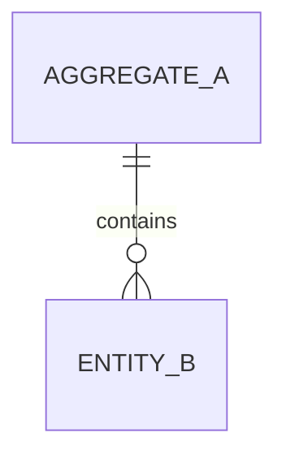
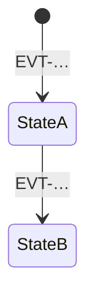

# Logical Data Model

> Stack-neutral. Source: `docs/domain/events.yaml`. As of: <date>

## Overview

## <Aggregate name> (`AGG-…`, context `BC-…`)

**Invariants**
- …

**Lifecycle**

| Element | Kind (root/entity/VO) | Attribute | Domain type | Required | Source (event/read model) |
|---|---|---|---|---|---|
| … | Root | … | … | yes | EVT-… |

**Open points:** HS-…
