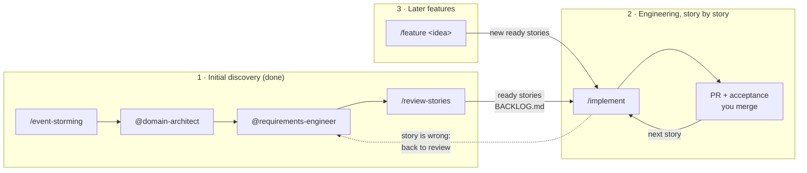

# La Guardia – Discovery and Engineering Workflow for Claude Code

> Named after Fiorello La Guardia, the New York mayor who banned pinball in 1942. This software keeps the museum's pinball machines running instead.

An AI-assisted workflow in two halves:

- **Discovery** captures the domain via event storming, settles the domain model and architecture, and derives user stories. The stories live as Markdown files in `docs/stories/` – together with the other artifacts in `docs/` they are the contract for engineering.
- **Engineering** implements those stories one by one, test-first, with automated checks that the code still matches the stories, the event storming model and the glossary.

The application itself (a Next.js monolith, `docs/adr/0001-tech-stack.md`) lives in this repository's root, next to `docs/`, and is created by the first stories.

## Setup

```bash
npm install --prefix .claude   # yaml (+ typescript/@types/node for the type check)
npm install                    # the application itself
claude                         # confirm folder trust (required for agent hooks)
```

Requirement: Node.js ≥ 22.18 in the PATH. The `.ts` tooling runs directly via Node's type stripping – no build step.

Two accesses make the engineering workflow a lot smoother – both are optional, `/implement` degrades gracefully without them:

| Access | Set up with | What it buys |
|---|---|---|
| GitHub CLI (`gh`), scope `repo` | `gh auth login` (`gh auth refresh -s repo` for the scope) | `/implement` opens the pull request itself; without it you get the compare URL from `git push` |
| Vercel MCP server (`vercel` in `.mcp.json`) | approve the project server on the first start, then `/mcp` to authenticate | preview deployment status, build and runtime logs for the acceptance step; without it, name the preview URL yourself |

Local development and the integration tests need a database: copy the values from `.env.example` into `.env.development.local`, then `npm run db:up` (PostgreSQL in Docker) and `npm run db:migrate:dev`. Environment values from Vercel come with `npx vercel env pull`.

The local browser tests (`npm run test:e2e`, `npm run verify -- --e2e`) need only `npm run db:up` and `E2E_TEAM_USERNAME` / `E2E_TEAM_PASSWORD` in `.env.development.local`: they start their own dev server on port 3100 (distDir `.next-e2e`) against `laguardia_e2e_test`, which is reset on every run and gets the e2e technician automatically. Your development database and a dev server on port 3000 are never touched (ST-083).

You don't have to remember any of this: the `session-start` hook checks all of it at the start of every session and reports only what is missing.

## Flow at a glance



You make the decisions at fixed points: answering grilling rounds, accepting ADRs, approving stories in the review, approving each story's test plan, accepting and merging each story.

### 1 · Initial discovery (completed – 64 stories are `ready`)

```text
/event-storming                          # big picture, starts by grilling the vision
/event-storming defect reporting         # detailed flow, as often as needed
@domain-architect Derive bounded contexts, aggregates and the logical data model from docs/domain/events.yaml. Prepare ADR 0001 for the tech stack decision.
@requirements-engineer Derive stories for all commands in context BC-….
/review-stories                          # PO + lead dev in parallel, you approve → ready
```

### 2 · Engineering – one story at a time

```text
/implement              # next ready story whose dependencies are done
/implement ST-010       # or a specific one
```

Each run of `/implement`:

| # | Step | You |
|---|---|---|
| 1 | Branch `st-NNN-…`, status `in-progress`, context pack from the discovery artifacts | |
| 2 | Test plan: every Gherkin scenario → a seam → a test | **approve** |
| 3 | Red → green, one scenario at a time (`tdd` skill), one commit per scenario | |
| 4 | `verify.ts`: lint incl. module boundaries, types, tests, traceability | |
| 5 | Review in parallel: `@code-reviewer`, `@acceptance-tester`, `/code-review`, `/security-review` where it applies | |
| 6 | Refactor on the findings; bigger ones become follow-up stories | |
| 7 | Pull request, check on the preview deployment at phone size, status `done` | **accept and merge** |

When a story turns out to be wrong or unclear, `/implement` stops, marks it `[OPEN]`, sets it back to `review` and it goes through discovery again – the code never decides open questions.

The first stories are the foundation: ST-001 (walking skeleton, a spike), ST-002, ST-059 (CI and test harness) and ST-003 (module structure, command layer). After ST-003 the engineering conventions and the seam catalog are written down in `.claude/skills/engineering-conventions/`.

Every few stories (after the foundation, when a bounded context is finished, or about every 8–10 stories): `/improve-codebase-architecture` – scans for shallow modules and grills you through the one you pick.

### 3 · Later features and changes

```text
/feature visitors attach photos to defect reports
```

Grills the idea while recording glossary terms and ADRs, runs a focused event storming, updates the domain model, derives stories (label `feature:<slug>`) and runs the story review on them. The approved stories appear as `ready` and are implemented with `/implement`.

### Anytime

`/grill-me` stress-tests a plan; `/grill-with-docs` does the same while recording glossary terms and ADRs.

## Principle: the LLM generates, code checks

| Task | Mechanism |
|---|---|
| Method (how?) | skills |
| Perspective (who reviews?) | subagents with restricted tools and write paths, reviewers on a different model than the author |
| Structure & consistency of the artifacts | JSON schemas + reference checks via hook (exit 2 → Claude must fix) |
| Generated views | `event-storming.md` and `BACKLOG.md` are rendered; manual edits are blocked |
| Story ↔ code traceability | every scenario has a test titled `ST-NNN: <scenario title>`; commands, events and read models carry their `CMD-`/`EVT-`/`RM-` ID in the code – checked by `verify.ts` |
| Story status | only valid transitions; `done` only with a test per scenario (or every checklist item ticked) and all dependencies done |
| Decisions | ADRs start `proposed`, only you set `accepted`; accepted ADRs can only be superseded, not edited; stories become `ready` only after your approval |
| Risky commands | force push, production deploy from the CLI and destructive commands on a non-local database are blocked |

Grilling, event storming, `/feature` and `/implement` deliberately run in the **main session**: subagents can't ask you questions and don't know the conversation. Subagents review.

## Checks by hand

```bash
node .claude/skills/implement/scripts/verify.ts            # the full gate (also `npm run verify` once the app exists)
node .claude/skills/implement/scripts/next-story.ts        # what's next
node .claude/skills/implement/scripts/story-context.ts ST-010   # everything discovery knows about a story
node .claude/skills/implement/scripts/check-scenarios.ts ST-010 # which scenarios still lack a test
node .claude/skills/event-storming/scripts/validate-events.ts
node .claude/skills/user-stories/scripts/validate-stories.ts
node .claude/skills/user-stories/scripts/render-backlog.ts # e.g. after deleting/renaming a story file
npm run --prefix .claude typecheck                         # after changing the tooling
```

## Story Status

`draft` → `review` → `ready` (size set, no `[OPEN]`) → `in-progress` → `done`

Discovery ends at `ready`. `/implement` sets `in-progress` and `done` via `story-status.ts`; a story that turns out wrong goes back to `review`. `done` is final – changes to finished behaviour are new stories. The backlog updates itself.

## Structure

```
CLAUDE.md                      project context, rules, workflow (loaded every session)
.mcp.json                      MCP servers for everyone working in this repo (Vercel)
CONTEXT.md                     glossary – the ubiquitous language (Matt Pocock's format)
docs/                          all other artifacts (source of truth): product, domain, architecture, adr, stories, reviews
.claude/
  settings.json                permissions + hooks
  package.json, tsconfig.json  tooling dependencies and type check
  agents/
    product-owner              value, scope, priority                        (Sonnet)
    lead-dev                   size, risk, slicing                           (Sonnet)
    requirements-engineer      derives and revises stories                   (Opus)
    domain-architect           contexts, aggregates, data model, ADRs        (Opus)
    code-reviewer              ADR/boundary conformance, language, test quality, smells   (Opus)
    acceptance-tester          scenario ↔ test, definition of done, edge cases           (Sonnet)
  skills/
    grilling/                  relentless interview in rounds (how every entry point asks questions)
    grill-me/                  /grill-me        – grill a plan or idea
    grill-with-docs/           /grill-with-docs – grill + record glossary terms and ADRs as we go
    event-storming/            /event-storming  – interactive workshop, starts by grilling the vision
    feature/                   /feature         – later features: grill → storm → model → stories → review
    domain-model/              language (CONTEXT.md), contexts, aggregates, data model
    architect/                 architecture decisions: ADR format, tech stack guide
    user-stories/              story rules, schema, validator, backlog renderer
    review-stories/            /review-stories  – PO + lead dev in parallel, approval
    implement/                 /implement       – engineering workflow + its scripts
    tdd/                       red → green loop, good tests, seams            (mattpocock/skills, adapted)
    codebase-design/           deep-module vocabulary                         (mattpocock/skills)
    improve-codebase-architecture/  /improve-codebase-architecture           (mattpocock/skills, adapted)
  hooks/
    validate-docs.ts           PostToolUse: validates events.yaml/stories incl. status changes, renders Mermaid + backlog
    code-check.ts              PostToolUse: Prettier + ESLint on the changed app file
    protect-files.ts           PreToolUse: blocks edits to generated files and accepted ADRs
    bash-guard.ts              PreToolUse: blocks force push, prod deploy, destructive DB commands
    path-guard.ts              PreToolUse (per agent): only allows writes in the agent's own folders
    stop-gate.ts               Stop: type check + related tests when app code changed
    session-start.ts           SessionStart: missing setup (deps, gh, Vercel MCP, database) + branch, story in progress, next story, last verify result
  lib/
    discovery.ts               shared logic for the discovery artifacts
    engineering.ts             shared logic for stories ↔ code (status workflow, traceability)
```

## Limits

- `path-guard` applies to `Write`/`Edit` only. The discovery agents therefore have no `Bash`; `code-reviewer` and `acceptance-tester` need it for git and test runs and are only instructed not to write with it.
- Hooks in agent files only run after you have confirmed the project folder as trusted. Hook changes take effect in a new session.
- `code-check.ts` and `stop-gate.ts` do nothing until the app exists; they expect Prettier, ESLint, `tsc` and Vitest in the app's `node_modules`.
- The language check only warns: the glossary's avoid lists contain ordinary programming words, so it can't be strict.
- The backlog is regenerated on every story write. Files deleted or renamed via the shell need a manual `render-backlog.ts` run.
- `tdd`, `codebase-design` and `improve-codebase-architecture` are copied from mattpocock/skills with small local fixes; updating them from upstream overwrites those fixes.
