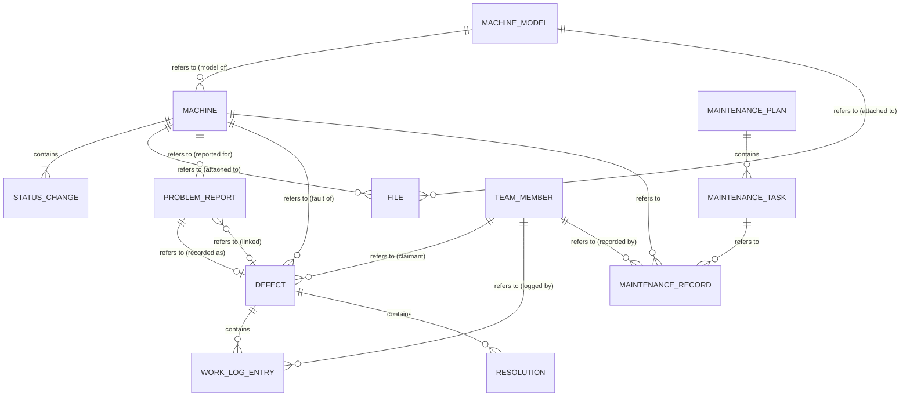
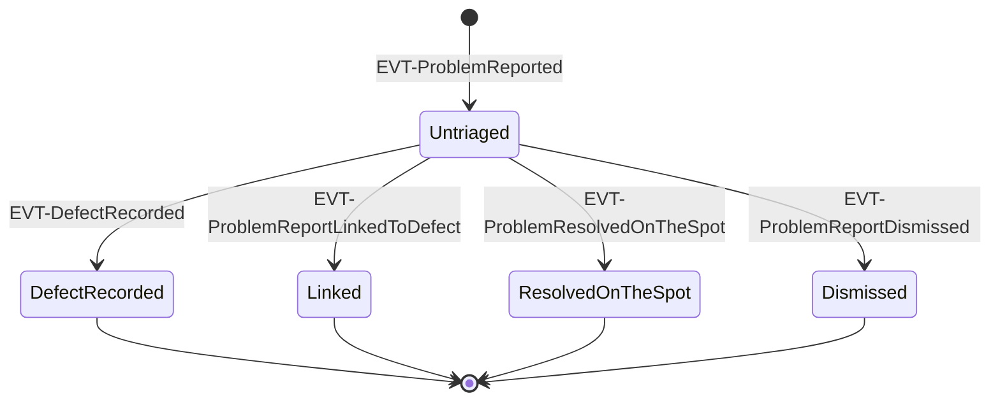
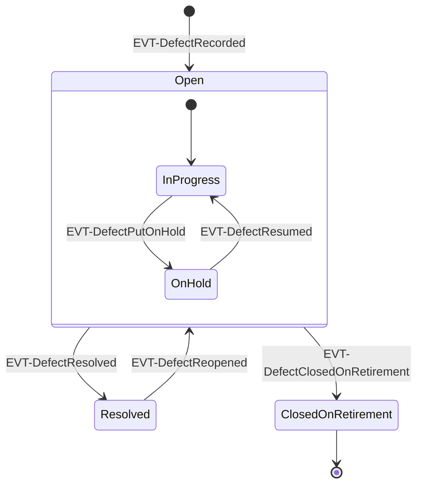
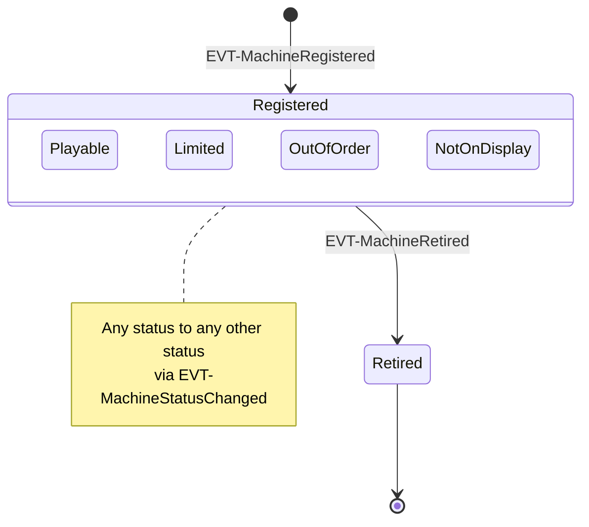
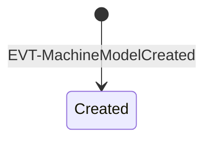
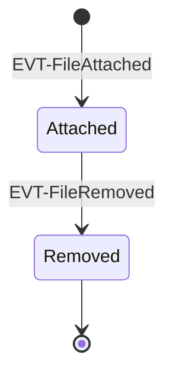
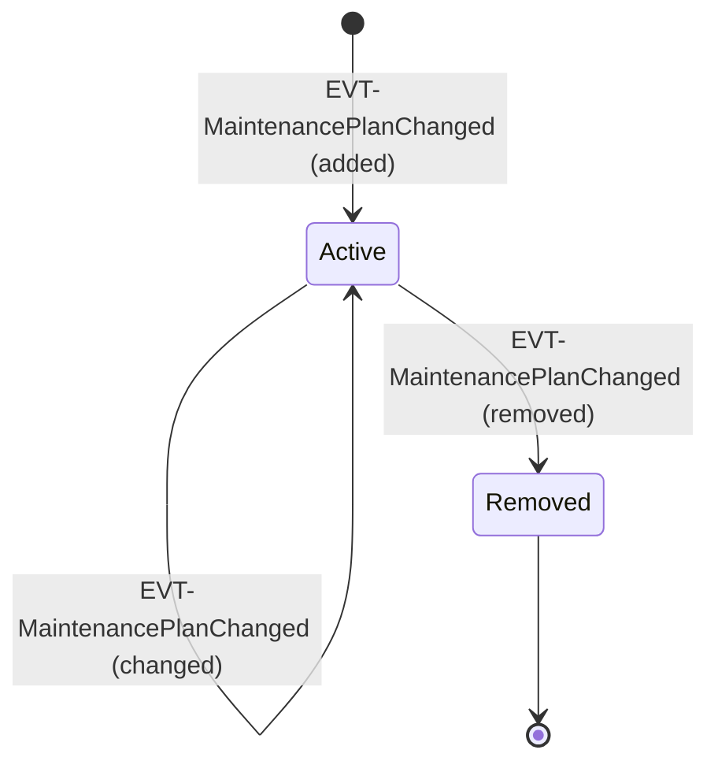
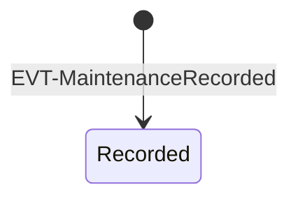
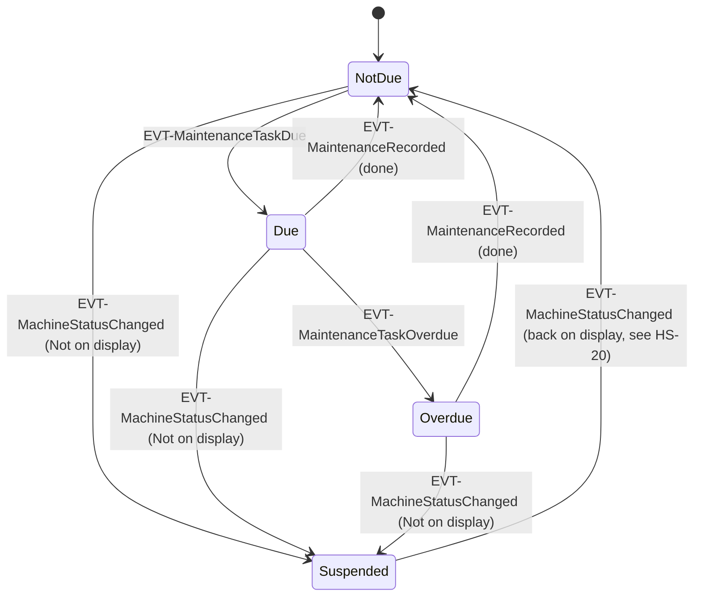

# Logical Data Model

> Stack-neutral. Source: `docs/domain/events.yaml`. Glossary: `CONTEXT.md`. Contexts: `docs/domain/context-map.md`. As of: 2026-09-26
>
> No physical model yet – the stack is only *proposed* (`docs/adr/0001-tech-stack.md`, `0002`, `0003`). A "Physical Model" section follows once the user accepts them.

## Conventions

- **References across aggregates are IDs only** (`MachineId`, `DefectId`, `TeamMemberId`, …). Within an aggregate, entities and value objects belong to their root.
- **Time of change**: every event has an occurrence time. Attributes named `… at` whose event lists no explicit time (e.g. `Claimed at` from `EVT-DefectClaimed`) take the occurrence time of that event. Where the event names a time explicitly (`Reported at`, `Logged at`, `Recorded at`), that is the source.
- **Derived, not stored**: *Due*, *Overdue*, *Last done*, *Due since*, counts and "waiting longer than 3 days" / "claims older than 14 days" are computed from stored data when read (`EVT-MaintenanceTaskDue` and `EVT-MaintenanceTaskOverdue` have `origin: time` and no aggregate).
- **People**: every "… by" is a `TeamMemberId` from the Team area (not modelled, see the end of this document). The only anonymous actor is the visitor as reporter of a problem report.

## Domain types

| Domain type | Meaning |
|---|---|
| `MachineId`, `MachineModelId`, `ProblemReportId`, `DefectId`, `WorkLogEntryId`, `FileId`, `MaintenanceTaskId`, `MaintenanceRecordId`, `TeamMemberId` | Opaque identity generated by La Guardia; never shown to users |
| `MuseumNumber` | Short museum identifier, e.g. `LG-042`; unique among all machines incl. retired (HS-17); auto-assigned as "LG-" plus three digits, never reused (HS-19) |
| `SerialNumber` | Manufacturer's number, free text |
| `Location` | Free text, e.g. "Hall 2, row 3" |
| `MachineStatus` | *Playable* \| *Limited* \| *Out of order* \| *Not on display* |
| `MachineCategory` | *Pinball* \| *Arcade* \| *Other* |
| `Technology` | Pinball: *EM* \| *Solid-state* \| *DMD* \| *LCD*; Arcade: *CRT* \| *LCD*; Other: none |
| `Year` | Calendar year of manufacture |
| `Priority` | *high* \| *normal* (default) \| *low* |
| `HoldReason` | *waiting for part* \| *waiting for technician* \| *other* |
| `TriageOutcome` | *defect recorded* \| *linked* \| *resolved on the spot* \| *dismissed* |
| `DismissalReason` | Reason for a dismissal; at least *spam* and *machine retired* must be recognisable (spam removes description and photo; retirement policy sets "machine retired") – the full list is still free ("e.g. not a fault, spam") |
| `Reporter` | Either *visitor* (anonymous, no further data) or a `TeamMemberId` |
| `FileCategory` | *Manual* \| *Schematic* \| *Photo* \| *Other* |
| `MaintenanceOutcome` | *done* \| *partially done* – only *done* resets the interval |
| `Interval` | Positive time span of a maintenance task (all initial values are whole months) |
| `Photo` | A stored image (content reference, media type, size); used by problem reports and work log entries |
| `FileContent` | A stored document or image (content reference, original name, media type, size) |
| `Text` / `Title` | Free text; `Title` is short and, for defects, understandable for visitors |
| `Timestamp` / `Date` | Point in time / calendar date |

## Overview

Relationships between aggregates are references by ID (labelled "refers to").

`TEAM_MEMBER` is also referenced by every other "… by" attribute; those lines are omitted for readability.

---

## Problem report (`AGG-ProblemReport`, context `BC-Repair`)

**Invariants**
- A problem report refers to exactly one machine, which never changes
- A problem report is triaged at most once – exactly one outcome (defect recorded, linked, resolved on the spot, dismissed)
- Once triaged, the outcome of a problem report never changes
- A problem report with the outcome defect recorded or linked refers to exactly one defect of the same machine
- A problem report dismissed as spam has no description and no photo

**Concurrency (HS-16):** the problem report is the consistency boundary of triage. *Record defect* is handled by the problem report, which marks itself triaged and creates the defect in one step; a concurrent second triage fails the version check on the problem report and is rejected.

**Lifecycle**

| Element | Kind | Attribute | Domain type | Required | Source (event/read model) |
|---|---|---|---|---|---|
| Problem report | Root | ID | `ProblemReportId` | yes | – (identity) |
| | | Machine | `MachineId` | yes | EVT-ProblemReported |
| | | Description | `Text` | yes, removed on spam dismissal | EVT-ProblemReported, EVT-ProblemReportDismissed |
| | | Photo | `Photo` | no, removed on spam dismissal | EVT-ProblemReported |
| | | Reporter | `Reporter` | yes | EVT-ProblemReported |
| | | Reported at | `Timestamp` | yes | EVT-ProblemReported |
| | | Triage | Triage (VO) | once triaged | see below |
| Triage | VO | Outcome | `TriageOutcome` | yes | EVT-DefectRecorded, EVT-ProblemReportLinkedToDefect, EVT-ProblemResolvedOnTheSpot, EVT-ProblemReportDismissed |
| | | Triaged by | `TeamMemberId` | yes | Recorded by / Linked by / Resolved by / Dismissed by of those events |
| | | Triaged at | `Timestamp` | yes | occurrence time of those events |
| | | Defect | `DefectId` | for *defect recorded* and *linked* | EVT-DefectRecorded, EVT-ProblemReportLinkedToDefect |
| | | Note | `Text` | for *resolved on the spot* | EVT-ProblemResolvedOnTheSpot |
| | | Dismissal reason | `DismissalReason` | for *dismissed* | EVT-ProblemReportDismissed |

Derived for read models: *Waiting longer than 3 days* (`RM-TriageList`, `RM-TechnicianDashboard`), *Number of untriaged problem reports* (`RM-VisitorMachinePage`), *Number of linked problem reports* (`RM-OpenDefects`), report time of a defect = earliest *Reported at* of its problem reports (`RM-RepairTimes`).

---

## Defect (`AGG-Defect`, context `BC-Repair`)

**Invariants**
- A defect refers to exactly one machine and to the problem report it was recorded from; neither ever changes
- A defect is either open (possibly on hold), resolved, or closed on retirement
- A resolved defect cannot be claimed, prioritized, put on hold or have work logged – only reopened
- A defect closed on retirement is final – it cannot be reopened or changed
- A defect has at most one claimant
- Only defects suitable for helpers can be claimed by, assigned to or resolved by helpers
- Only an open defect that is not on hold can be put on hold; only a defect on hold can be resumed
- Resolving ends the claim and any hold; a reopened defect is open, not on hold and unclaimed
- Work log entries are only added, never changed or removed

**Lifecycle** – prioritizing, claiming, releasing and logging work happen inside *Open* and do not change the state.

`InProgress` is only the name of the "open and not on hold" sub-state in this diagram, not a domain term.

| Element | Kind | Attribute | Domain type | Required | Source (event/read model) |
|---|---|---|---|---|---|
| Defect | Root | ID | `DefectId` | yes | – (identity) |
| | | Machine | `MachineId` | yes | EVT-DefectRecorded |
| | | Originating problem report | `ProblemReportId` | yes | EVT-DefectRecorded |
| | | Title | `Title` | yes | EVT-DefectRecorded, EVT-DefectDetailsChanged |
| | | Priority | `Priority` | yes (default *normal*) | EVT-DefectRecorded, EVT-DefectPrioritized |
| | | Suitable for helpers | Boolean | yes | EVT-DefectRecorded, EVT-DefectDetailsChanged |
| | | Recorded by | `TeamMemberId` | yes | EVT-DefectRecorded |
| | | Recorded at | `Timestamp` | yes | EVT-DefectRecorded (occurrence); *Open since* in RM-OpenDefects |
| | | State | *open* \| *resolved* \| *closed on retirement* | yes | EVT-DefectRecorded, EVT-DefectResolved, EVT-DefectReopened, EVT-DefectClosedOnRetirement |
| | | Closed on retirement at | `Timestamp` | when closed on retirement | EVT-DefectClosedOnRetirement |
| | | Claim | Claim (VO) | no | see below |
| | | Hold | Hold (VO) | no | see below |
| Claim | VO | Claimed by | `TeamMemberId` | yes | EVT-DefectClaimed |
| | | Assigned by | `TeamMemberId` | no | EVT-DefectClaimed |
| | | Claimed at | `Timestamp` | yes | EVT-DefectClaimed (occurrence); *claims older than 14 days* in RM-TechnicianDashboard |
| Hold | VO | Reason | `HoldReason` | yes | EVT-DefectPutOnHold |
| | | Note | `Text` | no | EVT-DefectPutOnHold |
| | | On hold since | `Timestamp` | yes | EVT-DefectPutOnHold (occurrence) |
| Work log entry | Entity | ID | `WorkLogEntryId` | yes | – (identity) |
| | | What was done | `Text` | yes | EVT-WorkLogged |
| | | Parts used | `Text` | no | EVT-WorkLogged |
| | | Photos | list of `Photo` | no | EVT-WorkLogged |
| | | Logged by | `TeamMemberId` | yes | EVT-WorkLogged |
| | | Logged at | `Timestamp` | yes | EVT-WorkLogged |
| Resolution | Entity | Closing note | `Text` | yes | EVT-DefectResolved |
| | | Resolved by | `TeamMemberId` | yes | EVT-DefectResolved |
| | | Resolved at | `Timestamp` | yes | EVT-DefectResolved (occurrence) |
| | | Reopen reason | `Text` or `ProblemReportId` | when reopened | EVT-DefectReopened (reason = the linked problem report when reopened by POL-LinkReopensResolvedDefect) |
| | | Reopened by | `TeamMemberId` | when reopened | EVT-DefectReopened |
| | | Reopened at | `Timestamp` | when reopened | EVT-DefectReopened (occurrence) |

A defect keeps one *Resolution* per resolve (with its reopening, if any), so closing notes and reopen reasons survive for the repair history (`RM-MachineRecord`). Derived: *Last work log entry* (`RM-OpenDefects`), time to first work log entry and to resolved (`RM-RepairTimes` – which resolution counts after a reopen is a detail for the story, recommendation: the latest).

---

## Machine (`AGG-Machine`, context `BC-Collection`)

**Invariants**
- A machine refers to exactly one machine model
- A machine always has exactly one museum number
- A machine always has exactly one machine status
- Every machine status change is kept in the machine's status history with previous status, new status, reason and who changed it
- A retired machine stays retired and cannot change status
- Helpers can only set Out of order

**Set-based rule (HS-17):** the museum number is unique among all machines, retired ones included – checked by *Register machine* and guaranteed atomically by the machine store, not by a single machine.

**Lifecycle** – inside *Registered*, `EVT-MachineStatusChanged` can move between any two machine statuses; the initial status comes from `EVT-MachineRegistered`.

| Element | Kind | Attribute | Domain type | Required | Source (event/read model) |
|---|---|---|---|---|---|
| Machine | Root | ID | `MachineId` | yes | – (identity) |
| | | Museum number | `MuseumNumber` | yes, unique | EVT-MachineRegistered, EVT-MachineDetailsCorrected |
| | | Machine model | `MachineModelId` | yes | EVT-MachineRegistered |
| | | Serial number | `SerialNumber` | no | EVT-MachineRegistered, EVT-MachineDetailsCorrected |
| | | Location | `Location` | yes | EVT-MachineRegistered, EVT-MachineMoved |
| | | Machine status | `MachineStatus` | yes | EVT-MachineRegistered, EVT-MachineStatusChanged |
| | | Registered at | `Timestamp` | yes | EVT-MachineRegistered (occurrence) |
| | | Retirement | Retirement (VO) | when retired | see below |
| Status change | Entity | Previous status | `MachineStatus` | yes | EVT-MachineStatusChanged |
| | | New status | `MachineStatus` | yes | EVT-MachineStatusChanged |
| | | Reason | `Text` | yes | EVT-MachineStatusChanged |
| | | Changed by | `TeamMemberId` | yes | EVT-MachineStatusChanged |
| | | Changed at | `Timestamp` | yes | EVT-MachineStatusChanged (occurrence) |
| Retirement | VO | Reason | `Text` | yes | EVT-MachineRetired |
| | | Retired by | `TeamMemberId` | yes | EVT-MachineRetired |
| | | Retired at | `Timestamp` | yes | EVT-MachineRetired (occurrence) |

The status history is needed by `RM-MachineRecord` ("Machine status with history") and by the due calculation (periods *Not on display*, HS-20). The initial status at registration counts as the first entry of the history (reason: registration).

---

## Machine model (`AGG-MachineModel`, context `BC-Collection`)

**Invariants**
- A machine model always has a title, a manufacturer and exactly one machine category
- The technology fits the machine category (Pinball – EM, Solid-state, DMD, LCD; Arcade – CRT, LCD; Other – none)

**Lifecycle**

Corrections: EVT-MachineModelCorrected (HS-18).

| Element | Kind | Attribute | Domain type | Required | Source (event/read model) |
|---|---|---|---|---|---|
| Machine model | Root | ID | `MachineModelId` | yes | – (identity) |
| | | Title | `Title` | yes | EVT-MachineModelCreated, EVT-MachineModelCorrected |
| | | Manufacturer | `Text` | yes | EVT-MachineModelCreated, EVT-MachineModelCorrected |
| | | Year | `Year` | no | EVT-MachineModelCreated, EVT-MachineModelCorrected |
| | | Machine category | `MachineCategory` | yes | EVT-MachineModelCreated, EVT-MachineModelCorrected |
| | | Technology | `Technology` | no | EVT-MachineModelCreated, EVT-MachineModelCorrected |

---

## File (`AGG-File`, context `BC-Collection`)

**Invariants**
- A file belongs to exactly one machine or one machine model, which never changes
- A file has exactly one file category
- A removed file stays removed

**Lifecycle**

| Element | Kind | Attribute | Domain type | Required | Source (event/read model) |
|---|---|---|---|---|---|
| File | Root | ID | `FileId` | yes | – (identity) |
| | | Attached to | `MachineId` xor `MachineModelId` | yes | EVT-FileAttached |
| | | Title | `Title` | yes | EVT-FileAttached |
| | | File category | `FileCategory` | yes | EVT-FileAttached |
| | | Content | `FileContent` | yes (until removed) | EVT-FileAttached |
| | | Attached by | `TeamMemberId` | yes | EVT-FileAttached |
| | | Attached at | `Timestamp` | yes | EVT-FileAttached (occurrence) |
| | | Removed by | `TeamMemberId` | when removed | EVT-FileRemoved |
| | | Removed at | `Timestamp` | when removed | EVT-FileRemoved (occurrence) |

Whether the content of a removed file is deleted or only hidden is not decided; recommendation: delete the content, keep the record (who removed what, when).

---

## Maintenance plan (`AGG-MaintenancePlan`, context `BC-Maintenance`)

**Invariants**
- Every maintenance task has a positive interval and a start date
- A restriction to a technology fits the restricted machine category
- A removed maintenance task never becomes due again; its maintenance records are kept

**Lifecycle** of a maintenance task within the plan (`EVT-MaintenancePlanChanged` covers added, changed and removed):

| Element | Kind | Attribute | Domain type | Required | Source (event/read model) |
|---|---|---|---|---|---|
| Maintenance plan | Root | – | – | – | singleton, one per museum |
| Maintenance task | Entity | ID | `MaintenanceTaskId` | yes | – (identity) |
| | | Name | `Title` | yes | EVT-MaintenancePlanChanged ("Maintenance task") |
| | | Instruction | `Text` | yes | EVT-MaintenancePlanChanged |
| | | Interval | `Interval` | yes | EVT-MaintenancePlanChanged |
| | | Suitable for helpers | Boolean | yes | EVT-MaintenancePlanChanged |
| | | Restriction | Restriction (VO) | no | EVT-MaintenancePlanChanged |
| | | Start date | `Date` | yes | EVT-MaintenancePlanChanged |
| | | Removed at | `Timestamp` | when removed | EVT-MaintenancePlanChanged (removed, occurrence) |
| Restriction | VO | Machine category | `MachineCategory` | no | EVT-MaintenancePlanChanged |
| | | Technology | `Technology` | no | EVT-MaintenancePlanChanged |

---

## Maintenance record (`AGG-MaintenanceRecord`, context `BC-Maintenance`)

**Invariants**
- A maintenance record refers to exactly one machine and one maintenance task
- A maintenance record has exactly one outcome – done or partially done
- A maintenance record is never changed or removed

**Lifecycle**

| Element | Kind | Attribute | Domain type | Required | Source (event/read model) |
|---|---|---|---|---|---|
| Maintenance record | Root | ID | `MaintenanceRecordId` | yes | – (identity) |
| | | Machine | `MachineId` | yes | EVT-MaintenanceRecorded |
| | | Maintenance task | `MaintenanceTaskId` | yes | EVT-MaintenanceRecorded |
| | | Outcome | `MaintenanceOutcome` | yes | EVT-MaintenanceRecorded |
| | | Note | `Text` | no | EVT-MaintenanceRecorded |
| | | Recorded by | `TeamMemberId` | yes | EVT-MaintenanceRecorded |
| | | Recorded at | `Timestamp` | yes | EVT-MaintenanceRecorded |

### Derived: due status per machine and maintenance task (not stored)

A maintenance task **applies** to a machine when the machine is registered and not retired and the task's restriction (if any) matches the machine model's machine category / technology. For each applicable pair:

- *Last done* = latest *Recorded at* with outcome *done*, otherwise the task's *Start date* (`RM-DueMaintenance`).
- *Due since* = *Last done* + *Interval*; never due while the machine is *Not on display* (status history).
- *Overdue* once due for more than 25% of the interval.
- A machine returning from *Not on display* is due immediately; overdue counts from the day it returned (HS-20).

`Suspended` is only a diagram label for "machine not on display", not a domain term.

---

## Team member (Team area – generic, not modelled)

Not an aggregate of this model; listed only because all contexts reference it (`docs/domain/context-map.md`, `docs/adr/0004-team-authentication.md`).

| Attribute | Domain type | Required | Source (event/read model) |
|---|---|---|---|
| ID | `TeamMemberId` | yes | every "… by" in events |
| Name | `Text` | yes | *Claimed by*, *Reporter* in RM-OpenDefects, RM-TriageList |
| Role | *Helper* \| *Technician* | yes | command rules (e.g. CMD-ClaimDefect, CMD-ChangeMachineStatus) |
| Last seen | `Timestamp` | no | *New since last login* in RM-TechnicianDashboard, RM-HelperDashboard – measured since the previous dashboard visit (HS-21) |

## Open points
HS-18 to HS-21 are resolved (see `docs/domain/events.yaml`): corrections have their own events, museum numbers are "LG-" plus three digits and never reused, a machine back on display is due immediately but overdue only counted from its return, and "new" is measured since the previous dashboard visit.
- Details for story refinement (no hotspot): full list of dismissal reasons; which resolution counts for repair times after a reopen; whether removed file content is deleted.
