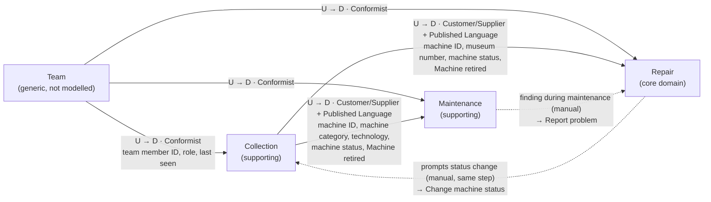

# Context Map

> Source: `docs/domain/events.yaml` (`bounded_contexts`, `aggregates`, `policies`, `read_models`), `docs/product/vision.md`. Glossary: `CONTEXT.md`. As of: 2026-09-26

## Contexts

| Context | Kind | Purpose | Core terms | Owner role | Aggregates |
|---|---|---|---|---|---|
| **Repair** (`BC-Repair`) | Core domain | From problem reports via triage to defects that are worked on and resolved – the reason La Guardia exists ("no defect gets lost", traceable repair history) | Problem report, Triage, Defect, Priority, Resolved on the spot, Claim, On hold, Closed on retirement, Work log entry, Repair history | Technician (triage, priority); every team member works on defects | `AGG-ProblemReport`, `AGG-Defect` |
| **Collection** (`BC-Collection`) | Supporting | Which machines the museum has, what they are, where they stand, whether they are playable, and their files | Machine, Machine model, Machine category, Technology, Museum number, Serial number, Location, Machine status, Registered / Retired machine, File, File category | Technician (registration, machine status, file removal); helpers may set *Out of order* and attach files | `AGG-Machine`, `AGG-MachineModel`, `AGG-File` |
| **Maintenance** (`BC-Maintenance`) | Supporting | The maintenance plan and keeping every machine's scheduled maintenance up to date | Maintenance task, Maintenance plan, Due / Overdue, Maintenance record, Suitable for helpers | Technician (maintenance plan); every team member records maintenance | `AGG-MaintenancePlan`, `AGG-MaintenanceRecord` |
| **Team** | Generic, **not modelled** | Team member accounts, roles (helper / technician), last login / last seen | Team member, Helper, Technician | Technician (manages accounts, `docs/product/vision.md`) | – (standard account management, see `docs/adr/0004-team-authentication.md`) |

The **Visitor** is not a context and has no account: visitor pages are a public view onto Collection and Repair (`RM-VisitorMachinePage`) plus the *Report problem* command of Repair.

## Relationships

Solid arrows: upstream (U) supplies, downstream (D) depends. Dotted arrows: the downstream context triggers a command of the other context through a manual policy – the upstream/downstream direction does not change.

### Collection → Repair (Customer/Supplier, Published Language)
- Collection is upstream: it owns the machine, its identity and its **machine status** (user decision). Repair references machines **by machine ID only** and never stores or changes the status itself.
- Published language: the events `EVT-MachineRegistered`, `EVT-MachineStatusChanged`, `EVT-MachineRetired` and the machine reference (machine ID, museum number).
- Repair reacts **automatically** to `EVT-MachineRetired`: `POL-RetirementClosesDefects` (→ `CMD-CloseDefectOnRetirement`) and `POL-RetirementDismissesProblemReports` (→ `CMD-DismissProblemReport`).
- Repair reads from Collection when checking command rules that are not its own invariants: *Report problem* (visitors only for machines on display, nobody for retired machines), *Reopen defect* (machine not retired). These are checks against the current machine state at command time, not invariants – a machine retired in the same second is caught by the retirement policies.
- Repair prompts status changes **manually**: `POL-DefectMayChangeMachineStatus` (new or reopened defect – the technician sets *Limited* / *Out of order* in the same step, HS-3) and `POL-ResolvedDefectsReturnMachineToPlay` (machines without open defects highlighted, the technician decides on *Playable*, HS-6). Both issue Collection's `CMD-ChangeMachineStatus`; the decision stays with the technician.

### Collection → Maintenance (Customer/Supplier, Published Language)
- Maintenance needs per machine: machine category and technology (via its machine model) to decide which maintenance tasks apply, and the machine status history, because machines that are *Not on display* never become due (HS-13, HS-20).
- `EVT-MachineRetired` removes the machine from due maintenance; `CMD-RecordMaintenance` checks that the machine is not retired.

### Maintenance → Repair (manual)
- `POL-MaintenanceFindingIsReported`: a fault found during maintenance becomes a problem report through Repair's normal `CMD-ReportProblem`. Maintenance has no knowledge of defects.

### Team → all contexts (Conformist)
- All contexts use the Team area's **team member ID** as the only reference to people (`Reported by`, `Claimed by`, `Recorded by`, …) and its **role** (helper / technician) for permission rules, e.g. "Helpers can only claim defects suitable for helpers", "Helpers can only set Out of order".
- The dashboards use the viewer's last login (or last visit, HS-21) from the Team area for "new since last login".
- Team is deliberately not modelled as a domain: it is standard account management (`docs/adr/0004-team-authentication.md`).

## Cross-context read models

Read models compose data from several contexts; they only read, every write goes through the owning context's commands (`docs/adr/0002-modular-monolith-state-based-persistence.md`).

| Read model | Collection | Repair | Maintenance | Team |
|---|---|---|---|---|
| `RM-VisitorMachinePage` | x | x | | |
| `RM-TriageList` | x | x | | x |
| `RM-OpenDefects` | x | x | | x |
| `RM-MachineOverview` | x | x | x | |
| `RM-MachineRecord` | x | x | x | x |
| `RM-DueMaintenance` | x | | x | |
| `RM-MaintenancePlan` | | | x | |
| `RM-TechnicianDashboard` | x | x | x | x |
| `RM-HelperDashboard` | | x | x | x |
| `RM-RepairTimes` | | x | | |

## Open points
- HS-18 – no events for corrections (location, machine model, museum number, defect title) – affects the Collection and Repair aggregates.
- HS-21 – "new since last login" vs. last visit – affects what the Team area must record.
