# Event Storming – Pinball Museum

> Generated from `docs/domain/events.yaml` – **do not edit manually**.

Legend: 🟧 Event · 🟦 Command · 🟪 Policy · 🟩 Read model · 🟨 Actor · 🩷 External system · 🟥 Hotspot · ⭐ Pivotal event

## Big Picture

```mermaid
flowchart LR
    subgraph BC_Repair["Repair"]
        CMD_ReportProblem["Report problem"]:::cmd
        CMD_RecordDefect["Record defect"]:::cmd
        CMD_LinkProblemReportToDefect["Link problem report to defect"]:::cmd
        CMD_ResolveProblemOnTheSpot["Resolve problem on the spot"]:::cmd
        CMD_DismissProblemReport["Dismiss problem report"]:::cmd
        CMD_PrioritizeDefect["Prioritize defect"]:::cmd
        CMD_ChangeDefectDetails["Change defect details"]:::cmd
        CMD_ClaimDefect["Claim defect"]:::cmd
        CMD_ReleaseClaim["Release claim"]:::cmd
        CMD_LogWork["Log work"]:::cmd
        CMD_PutDefectOnHold["Put defect on hold"]:::cmd
        CMD_ResumeDefect["Resume defect"]:::cmd
        CMD_ResolveDefect["Resolve defect"]:::cmd
        CMD_ReopenDefect["Reopen defect"]:::cmd
        CMD_CloseDefectOnRetirement["Close defect on retirement"]:::cmd
        EVT_ProblemReported["⭐ Problem reported"]:::evt
        EVT_DefectRecorded["⭐ Defect recorded"]:::evt
        EVT_ProblemReportLinkedToDefect["Problem report linked to defect"]:::evt
        EVT_ProblemResolvedOnTheSpot["Problem resolved on the spot"]:::evt
        EVT_ProblemReportDismissed["Problem report dismissed"]:::evt
        EVT_DefectPrioritized["Defect prioritized"]:::evt
        EVT_DefectDetailsChanged["Defect details changed"]:::evt
        EVT_DefectClaimed["Defect claimed"]:::evt
        EVT_DefectClaimReleased["Defect claim released"]:::evt
        EVT_WorkLogged["Work logged"]:::evt
        EVT_DefectPutOnHold["Defect put on hold"]:::evt
        EVT_DefectResumed["Defect resumed"]:::evt
        EVT_DefectResolved["⭐ Defect resolved"]:::evt
        EVT_DefectReopened["Defect reopened"]:::evt
        EVT_DefectClosedOnRetirement["Defect closed on retirement"]:::evt
    end
    subgraph BC_Collection["Collection"]
        CMD_CreateMachineModel["Create machine model"]:::cmd
        CMD_RegisterMachine["Register machine"]:::cmd
        CMD_ChangeMachineStatus["Change machine status"]:::cmd
        CMD_MoveMachine["Move machine"]:::cmd
        CMD_CorrectMachineDetails["Correct machine details"]:::cmd
        CMD_CorrectMachineModel["Correct machine model"]:::cmd
        CMD_AttachFile["Attach file"]:::cmd
        CMD_RemoveFile["Remove file"]:::cmd
        CMD_RetireMachine["Retire machine"]:::cmd
        EVT_MachineModelCreated["Machine model created"]:::evt
        EVT_MachineRegistered["⭐ Machine registered"]:::evt
        EVT_MachineStatusChanged["⭐ Machine status changed"]:::evt
        EVT_MachineMoved["Machine moved"]:::evt
        EVT_MachineDetailsCorrected["Machine details corrected"]:::evt
        EVT_MachineModelCorrected["Machine model corrected"]:::evt
        EVT_FileAttached["File attached"]:::evt
        EVT_FileRemoved["File removed"]:::evt
        EVT_MachineRetired["⭐ Machine retired"]:::evt
    end
    subgraph BC_Maintenance["Maintenance"]
        CMD_ChangeMaintenancePlan["Change maintenance plan"]:::cmd
        CMD_RecordMaintenance["Record maintenance"]:::cmd
        EVT_MaintenancePlanChanged["Maintenance plan changed"]:::evt
        EVT_MaintenanceTaskDue["⭐ Maintenance task due"]:::evt
        EVT_MaintenanceTaskOverdue["Maintenance task overdue"]:::evt
        EVT_MaintenanceRecorded["Maintenance recorded"]:::evt
    end
    ACT_Visitor(["Visitor"]):::act
    ACT_Helper(["Helper"]):::act
    ACT_Technician(["Technician"]):::act
    ACT_TeamMember(["Team member"]):::act
    POL_LinkReopensResolvedDefect{{"Linking to a resolved defect reopens it"}}:::pol
    POL_RetirementClosesDefects{{"Retirement closes open defects"}}:::pol
    POL_RetirementDismissesProblemReports{{"Retirement dismisses untriaged problem reports"}}:::pol
    POL_TriageProblemReports{{"New problem reports are triaged"}}:::pol
    POL_DefectMayChangeMachineStatus{{"A new or reopened defect may change the machine status"}}:::pol
    POL_ResolvedDefectsReturnMachineToPlay{{"Machines without open defects return to play"}}:::pol
    POL_DueMaintenanceIsCarriedOut{{"Due maintenance is carried out"}}:::pol
    POL_MaintenanceFindingIsReported{{"Findings during maintenance are reported"}}:::pol
    RM_VisitorMachinePage[("Visitor machine page")]:::rm
    RM_TriageList[("Triage list")]:::rm
    RM_OpenDefects[("Open defects")]:::rm
    RM_MachineOverview[("Machine overview")]:::rm
    RM_MachineRecord[("Machine record")]:::rm
    RM_DueMaintenance[("Due maintenance")]:::rm
    RM_MaintenancePlan[("Maintenance plan")]:::rm
    RM_TechnicianDashboard[("Technician dashboard")]:::rm
    RM_HelperDashboard[("Helper dashboard")]:::rm
    RM_RepairTimes[("Repair times")]:::rm
    ACT_Visitor --> CMD_ReportProblem
    CMD_ReportProblem --> EVT_ProblemReported
    ACT_Technician --> CMD_RecordDefect
    CMD_RecordDefect --> EVT_DefectRecorded
    ACT_Technician --> CMD_LinkProblemReportToDefect
    CMD_LinkProblemReportToDefect --> EVT_ProblemReportLinkedToDefect
    ACT_TeamMember --> CMD_ResolveProblemOnTheSpot
    CMD_ResolveProblemOnTheSpot --> EVT_ProblemResolvedOnTheSpot
    ACT_Technician --> CMD_DismissProblemReport
    CMD_DismissProblemReport --> EVT_ProblemReportDismissed
    ACT_Technician --> CMD_PrioritizeDefect
    CMD_PrioritizeDefect --> EVT_DefectPrioritized
    ACT_Technician --> CMD_ChangeDefectDetails
    CMD_ChangeDefectDetails --> EVT_DefectDetailsChanged
    ACT_TeamMember --> CMD_ClaimDefect
    CMD_ClaimDefect --> EVT_DefectClaimed
    ACT_TeamMember --> CMD_ReleaseClaim
    CMD_ReleaseClaim --> EVT_DefectClaimReleased
    ACT_TeamMember --> CMD_LogWork
    CMD_LogWork --> EVT_WorkLogged
    ACT_TeamMember --> CMD_PutDefectOnHold
    CMD_PutDefectOnHold --> EVT_DefectPutOnHold
    ACT_TeamMember --> CMD_ResumeDefect
    CMD_ResumeDefect --> EVT_DefectResumed
    ACT_TeamMember --> CMD_ResolveDefect
    CMD_ResolveDefect --> EVT_DefectResolved
    ACT_TeamMember --> CMD_ReopenDefect
    CMD_ReopenDefect --> EVT_DefectReopened
    ACT_Technician --> CMD_CreateMachineModel
    CMD_CreateMachineModel --> EVT_MachineModelCreated
    ACT_Technician --> CMD_RegisterMachine
    CMD_RegisterMachine --> EVT_MachineRegistered
    ACT_Technician --> CMD_ChangeMachineStatus
    CMD_ChangeMachineStatus --> EVT_MachineStatusChanged
    ACT_TeamMember --> CMD_MoveMachine
    CMD_MoveMachine --> EVT_MachineMoved
    ACT_Technician --> CMD_CorrectMachineDetails
    CMD_CorrectMachineDetails --> EVT_MachineDetailsCorrected
    ACT_Technician --> CMD_CorrectMachineModel
    CMD_CorrectMachineModel --> EVT_MachineModelCorrected
    ACT_TeamMember --> CMD_AttachFile
    CMD_AttachFile --> EVT_FileAttached
    ACT_Technician --> CMD_RemoveFile
    CMD_RemoveFile --> EVT_FileRemoved
    ACT_Technician --> CMD_RetireMachine
    CMD_RetireMachine --> EVT_MachineRetired
    CMD_CloseDefectOnRetirement --> EVT_DefectClosedOnRetirement
    ACT_Technician --> CMD_ChangeMaintenancePlan
    CMD_ChangeMaintenancePlan --> EVT_MaintenancePlanChanged
    ACT_TeamMember --> CMD_RecordMaintenance
    CMD_RecordMaintenance --> EVT_MaintenanceRecorded
    EVT_ProblemReportLinkedToDefect --> POL_LinkReopensResolvedDefect
    POL_LinkReopensResolvedDefect --> CMD_ReopenDefect
    EVT_MachineRetired --> POL_RetirementClosesDefects
    POL_RetirementClosesDefects --> CMD_CloseDefectOnRetirement
    EVT_MachineRetired --> POL_RetirementDismissesProblemReports
    POL_RetirementDismissesProblemReports --> CMD_DismissProblemReport
    EVT_ProblemReported --> POL_TriageProblemReports
    POL_TriageProblemReports --> CMD_RecordDefect
    POL_TriageProblemReports --> CMD_LinkProblemReportToDefect
    POL_TriageProblemReports --> CMD_ResolveProblemOnTheSpot
    POL_TriageProblemReports --> CMD_DismissProblemReport
    EVT_DefectRecorded --> POL_DefectMayChangeMachineStatus
    EVT_DefectReopened --> POL_DefectMayChangeMachineStatus
    POL_DefectMayChangeMachineStatus --> CMD_ChangeMachineStatus
    EVT_DefectResolved --> POL_ResolvedDefectsReturnMachineToPlay
    POL_ResolvedDefectsReturnMachineToPlay --> CMD_ChangeMachineStatus
    EVT_MaintenanceTaskDue --> POL_DueMaintenanceIsCarriedOut
    EVT_MaintenanceTaskOverdue --> POL_DueMaintenanceIsCarriedOut
    POL_DueMaintenanceIsCarriedOut --> CMD_RecordMaintenance
    EVT_MaintenanceRecorded --> POL_MaintenanceFindingIsReported
    POL_MaintenanceFindingIsReported --> CMD_ReportProblem
    EVT_MachineModelCreated -.-> RM_VisitorMachinePage
    EVT_MachineRegistered -.-> RM_VisitorMachinePage
    EVT_MachineStatusChanged -.-> RM_VisitorMachinePage
    EVT_MachineRetired -.-> RM_VisitorMachinePage
    EVT_ProblemReported -.-> RM_VisitorMachinePage
    EVT_DefectRecorded -.-> RM_VisitorMachinePage
    EVT_ProblemReportLinkedToDefect -.-> RM_VisitorMachinePage
    EVT_ProblemResolvedOnTheSpot -.-> RM_VisitorMachinePage
    EVT_ProblemReportDismissed -.-> RM_VisitorMachinePage
    EVT_DefectResolved -.-> RM_VisitorMachinePage
    EVT_DefectReopened -.-> RM_VisitorMachinePage
    EVT_DefectClosedOnRetirement -.-> RM_VisitorMachinePage
    EVT_MachineModelCorrected -.-> RM_VisitorMachinePage
    EVT_DefectDetailsChanged -.-> RM_VisitorMachinePage
    RM_VisitorMachinePage -.-> ACT_Visitor
    EVT_ProblemReported -.-> RM_TriageList
    EVT_DefectRecorded -.-> RM_TriageList
    EVT_ProblemReportLinkedToDefect -.-> RM_TriageList
    EVT_ProblemResolvedOnTheSpot -.-> RM_TriageList
    EVT_ProblemReportDismissed -.-> RM_TriageList
    EVT_MachineRetired -.-> RM_TriageList
    EVT_DefectDetailsChanged -.-> RM_TriageList
    RM_TriageList -.-> ACT_Technician
    RM_TriageList -.-> ACT_Helper
    EVT_DefectRecorded -.-> RM_OpenDefects
    EVT_DefectPrioritized -.-> RM_OpenDefects
    EVT_DefectClaimed -.-> RM_OpenDefects
    EVT_DefectClaimReleased -.-> RM_OpenDefects
    EVT_WorkLogged -.-> RM_OpenDefects
    EVT_DefectPutOnHold -.-> RM_OpenDefects
    EVT_DefectResumed -.-> RM_OpenDefects
    EVT_DefectResolved -.-> RM_OpenDefects
    EVT_DefectReopened -.-> RM_OpenDefects
    EVT_DefectClosedOnRetirement -.-> RM_OpenDefects
    EVT_ProblemReportLinkedToDefect -.-> RM_OpenDefects
    EVT_DefectDetailsChanged -.-> RM_OpenDefects
    RM_OpenDefects -.-> ACT_TeamMember
    EVT_MachineModelCreated -.-> RM_MachineOverview
    EVT_MachineRegistered -.-> RM_MachineOverview
    EVT_MachineStatusChanged -.-> RM_MachineOverview
    EVT_MachineRetired -.-> RM_MachineOverview
    EVT_DefectRecorded -.-> RM_MachineOverview
    EVT_DefectResolved -.-> RM_MachineOverview
    EVT_DefectReopened -.-> RM_MachineOverview
    EVT_DefectClosedOnRetirement -.-> RM_MachineOverview
    EVT_MaintenanceTaskOverdue -.-> RM_MachineOverview
    EVT_MaintenanceRecorded -.-> RM_MachineOverview
    EVT_MachineMoved -.-> RM_MachineOverview
    EVT_MachineDetailsCorrected -.-> RM_MachineOverview
    EVT_MachineModelCorrected -.-> RM_MachineOverview
    RM_MachineOverview -.-> ACT_TeamMember
    EVT_MachineModelCreated -.-> RM_MachineRecord
    EVT_MachineRegistered -.-> RM_MachineRecord
    EVT_MachineStatusChanged -.-> RM_MachineRecord
    EVT_MachineRetired -.-> RM_MachineRecord
    EVT_FileAttached -.-> RM_MachineRecord
    EVT_FileRemoved -.-> RM_MachineRecord
    EVT_DefectRecorded -.-> RM_MachineRecord
    EVT_WorkLogged -.-> RM_MachineRecord
    EVT_DefectResolved -.-> RM_MachineRecord
    EVT_DefectReopened -.-> RM_MachineRecord
    EVT_DefectPutOnHold -.-> RM_MachineRecord
    EVT_DefectResumed -.-> RM_MachineRecord
    EVT_DefectClosedOnRetirement -.-> RM_MachineRecord
    EVT_ProblemResolvedOnTheSpot -.-> RM_MachineRecord
    EVT_MaintenanceRecorded -.-> RM_MachineRecord
    EVT_MaintenanceTaskDue -.-> RM_MachineRecord
    EVT_MachineMoved -.-> RM_MachineRecord
    EVT_MachineDetailsCorrected -.-> RM_MachineRecord
    EVT_MachineModelCorrected -.-> RM_MachineRecord
    EVT_DefectDetailsChanged -.-> RM_MachineRecord
    RM_MachineRecord -.-> ACT_TeamMember
    EVT_MaintenancePlanChanged -.-> RM_DueMaintenance
    EVT_MaintenanceTaskDue -.-> RM_DueMaintenance
    EVT_MaintenanceTaskOverdue -.-> RM_DueMaintenance
    EVT_MaintenanceRecorded -.-> RM_DueMaintenance
    EVT_MachineRegistered -.-> RM_DueMaintenance
    EVT_MachineStatusChanged -.-> RM_DueMaintenance
    EVT_MachineRetired -.-> RM_DueMaintenance
    EVT_MachineMoved -.-> RM_DueMaintenance
    EVT_MachineModelCorrected -.-> RM_DueMaintenance
    RM_DueMaintenance -.-> ACT_TeamMember
    EVT_MaintenancePlanChanged -.-> RM_MaintenancePlan
    RM_MaintenancePlan -.-> ACT_Technician
    EVT_ProblemReported -.-> RM_TechnicianDashboard
    EVT_DefectRecorded -.-> RM_TechnicianDashboard
    EVT_ProblemReportLinkedToDefect -.-> RM_TechnicianDashboard
    EVT_ProblemResolvedOnTheSpot -.-> RM_TechnicianDashboard
    EVT_ProblemReportDismissed -.-> RM_TechnicianDashboard
    EVT_MachineStatusChanged -.-> RM_TechnicianDashboard
    EVT_DefectResolved -.-> RM_TechnicianDashboard
    EVT_DefectReopened -.-> RM_TechnicianDashboard
    EVT_DefectClaimed -.-> RM_TechnicianDashboard
    EVT_WorkLogged -.-> RM_TechnicianDashboard
    EVT_MaintenanceTaskOverdue -.-> RM_TechnicianDashboard
    EVT_MaintenanceRecorded -.-> RM_TechnicianDashboard
    RM_TechnicianDashboard -.-> ACT_Technician
    EVT_DefectRecorded -.-> RM_HelperDashboard
    EVT_DefectClaimed -.-> RM_HelperDashboard
    EVT_DefectClaimReleased -.-> RM_HelperDashboard
    EVT_WorkLogged -.-> RM_HelperDashboard
    EVT_DefectResolved -.-> RM_HelperDashboard
    EVT_DefectReopened -.-> RM_HelperDashboard
    EVT_MaintenanceTaskDue -.-> RM_HelperDashboard
    EVT_MaintenanceTaskOverdue -.-> RM_HelperDashboard
    EVT_MaintenanceRecorded -.-> RM_HelperDashboard
    EVT_DefectDetailsChanged -.-> RM_HelperDashboard
    RM_HelperDashboard -.-> ACT_Helper
    EVT_ProblemReported -.-> RM_RepairTimes
    EVT_DefectRecorded -.-> RM_RepairTimes
    EVT_ProblemReportLinkedToDefect -.-> RM_RepairTimes
    EVT_WorkLogged -.-> RM_RepairTimes
    EVT_DefectResolved -.-> RM_RepairTimes
    RM_RepairTimes -.-> ACT_Technician
    classDef evt fill:#a3391f,stroke:#e65100,color:#fff
    classDef cmd fill:#64b5f6,stroke:#0d47a1,color:#000
    classDef pol fill:#ce93d8,stroke:#4a148c,color:#000
    classDef rm fill:#81c784,stroke:#1b5e20,color:#000
    classDef act fill:#a3751f,stroke:#f57f17,color:#000
    classDef ext fill:#f48fb1,stroke:#880e4f,color:#000
    classDef agg fill:#ffe082,stroke:#ff6f00,color:#000
    classDef hs fill:#e57373,stroke:#b71c1c,color:#fff
```

## Flows

### From problem report to defect

Main path shown. Alternative triage outcomes instead of Defect recorded: Problem report linked to defect, Problem resolved on the spot, Problem report dismissed.

### Repairing a defect

On hold / resumed and work logged may repeat. Reopened leads back to claiming and work. After resolution the technician may return the machine to Playable.

### Scheduled maintenance

Repeats per machine and maintenance task. A finding during maintenance becomes a problem report and enters the triage flow.

### Machine lifecycle

## Bounded Contexts & Aggregates

| Context | Purpose | Aggregates | Events |
|---|---|---|---|
| Collection (`BC-Collection`) | Which machines the museum has, what they are, where they stand, whether they are playable, and their files | Machine, Machine model, File | Machine model created, Machine registered, Machine status changed, Machine moved, Machine details corrected, Machine model corrected, File attached, File removed, Machine retired |
| Repair (`BC-Repair`) | From problem reports via triage to defects that are worked on and resolved | Problem report, Defect | Problem reported, Defect recorded, Problem report linked to defect, Problem resolved on the spot, Problem report dismissed, Defect prioritized, Defect details changed, Defect claimed, Defect claim released, Work logged, Defect put on hold, Defect resumed, Defect resolved, Defect reopened, Defect closed on retirement |
| Team (`BC-Team`) | Generic, not modelled – team member accounts, roles (helper, technician), signing in and last visit; supplier to all other contexts | – | – |
| Maintenance (`BC-Maintenance`) | The maintenance plan and keeping every machine's scheduled maintenance up to date | Maintenance plan, Maintenance record | Maintenance plan changed, Maintenance task due, Maintenance task overdue, Maintenance recorded |
